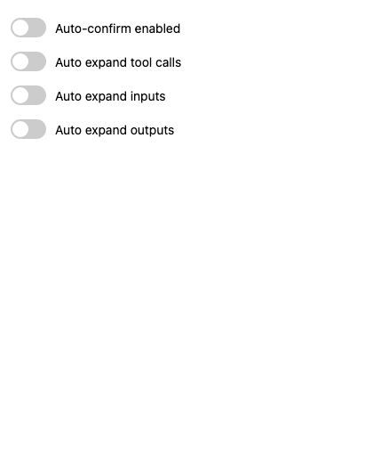

# Auto Confirm for ChatGPT

Fork of https://chromewebstore.google.com/detail/auto-confirm-for-chatgpt/dfiponmapmachnpedjilhecigmmggffk

This extension is intended for debugging custom GPTs and automating confirmation dialogs in ChatGPT. Use it at your own risk.

## What it does

- Automatically detects and clicks confirmation buttons in ChatGPT dialogs
- Supports multiple languages via built-in selector configuration
- Includes a debug mode for inspecting selector behavior in DevTools

## Installation

1. Open `chrome://extensions/` in Chrome
2. Enable Developer mode
3. Click "Load unpacked" and select this folder

## Usage

- Open a ChatGPT dialog with a `Confirm` button
- Toggle the extension from the toolbar icon
- If enabled, the extension will attempt to click the button automatically

## Debugging

- Set `CONFIG.DEBUG = true` in `content.js`
- Open DevTools Console on the ChatGPT page
- Update selector values in `CONFIG.SELECTORS` when UI changes

## Disclaimer

This repository is a fork and experimental tool. It should only be used for development and debugging of custom GPT behavior.

## Optional background mode

Version 1.7.0 adds two opt-in switches in the popup:

- **Background clicks via debugger** — uses the Chrome `debugger` permission and CDP `Input.dispatchMouseEvent` for the final confirm click. This is off by default and Chrome may show a debugger warning while the click is being dispatched.
- **Countdown in tab title** — temporarily prefixes the tab title with `[AC 3]`, `[AC 2]`, `[AC 1]`, `[AC click]` during the confirm countdown. This is off by default.

The normal foreground DOM click path is unchanged when background clicks are disabled.

